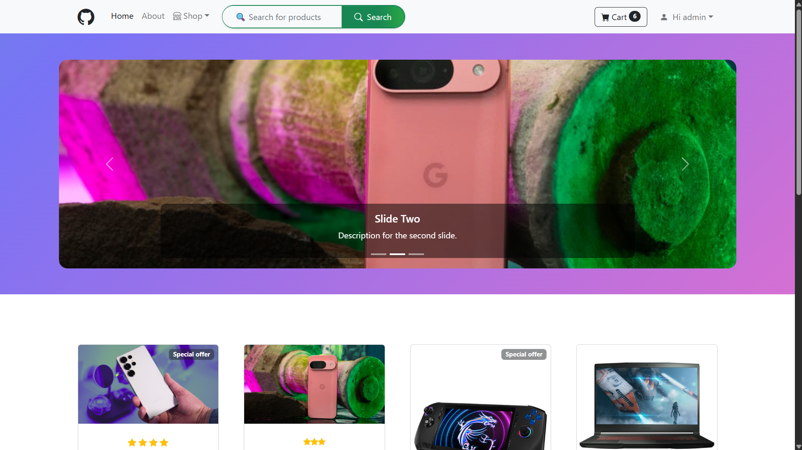

# Ecommerce App 



A beautiful and fully functional ecommerce web application built with Django. This project provides a seamless shopping experience with product browsing, cart management, and payment integration.
<span style="color: red; font-size : 20px">Note: you can add more features according to your requirements!</span>

## Features

- Browse products by category
- Add products to cart and manage cart items
- Secure checkout and payment processing
- User authentication and profile management
- Responsive design with clean UI

## Technologies Used

- Django 5.2.1
- SQLite database
- Pillow for image processing
- django-cleanup for media file management
- django-widget-tweaks for enhanced form rendering
- HTML, CSS, JavaScript, Bootstrap for frontend

## Installation

1. Clone the repository:
   ```bash
   git clone <git@github.com:Hasibafghan/django-ecommerce-app.git>
   cd SimpleEcommerceApp
   ```

2. Create and activate a virtual environment:
   ```bash
   python -m venv venv
   source venv/bin/activate  # On Windows use `venv\Scripts\activate`
   ```

3. Install dependencies:
   ```bash
   pip install -r requirements.txt
   ```

4. Apply migrations:
   ```bash
   python manage.py migrate
   ```

5. Run the development server:
   ```bash
   python manage.py runserver
   ```

6. Open your browser and go to `http://127.0.0.1:8000/`

## Usage

- Browse products on the homepage or by category
- Add desired products to your cart
- Proceed to checkout and complete payment
- Manage your user profile and order history

## Project Structure

- `shop/` - Product catalog and related views
- `cart/` - Shopping cart functionality
- `payment/` - Payment processing and order management
- `simple_ecommerce_core/` - Project settings and configuration
- `templates/` - HTML templates for rendering pages
- `static/` - Static assets like CSS, JS, and images
- `media/` - Uploaded media files such as product images

## Contributing

Contributions are welcome! Please fork the repository and create a pull request.

## License

This project is FREE! .

## Contact

For any inquiries or support, please contact [me] at [hasibalamyar2@gmail.com].
